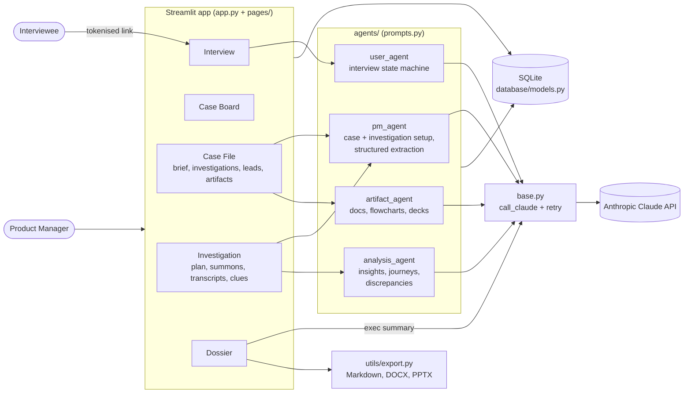

# Dupin

An AI discovery agent for product managers: it interviews your users, then turns the transcripts into insights, user journeys and contradictions.

## Executive summary

- **Problem:** A product manager can run only a handful of discovery interviews a week, and then has to wade through the transcripts. So discovery gets skipped, or rests on a few loud voices.
- **What it does:** The PM describes the product (a "case") in conversation with Dupin, plans an investigation, and generates a unique interview link for each user. Claude interviews each user through a structured conversation. Dupin then analyses the completed transcripts into pain points, journeys, expectations and contradictions, and exports the results as reports.
- **Who it's for:** product managers and product teams doing user discovery on internal or external products.
- **Status:** working prototype (POC). It runs locally or on Streamlit, has no authentication, and is not production-hardened.
- **Technical highlights:** a multi-page Streamlit app; several prompt-specialised Claude agents (case setup, investigation planning, interviewer, analyst, artifact writer); a state machine that guides each interview; contradiction detection between users, and between users and the product's stated behaviour; SQLite persistence; Markdown, DOCX and PPTX exports.

## How it works

Dupin uses detective vocabulary throughout the UI. A product is a **case**, a research effort is an **investigation**, an interview invite is a **summons**, and a report is a **dossier**.

1. **Open a case (Case Board → Case File).** The PM chats with Dupin about the product: what it does, who uses it, and how it works today. PRDs, specs and notes can be uploaded (`.md`, `.txt`, `.pdf`, `.docx`, `.csv`, `.json`, `.yaml`). Dupin decides when enough has been said, then extracts a structured brief (description, documentation, current state). It keeps a case history of how the brief has changed.
2. **Plan an investigation (Case File → Investigations → Investigation Plan).** In a second conversation, Dupin helps set the objective, scope and target personas. The PM tunes the interviewer's behaviour:
   - interrogation depth: `listener`, `balanced` or `deep_researcher`
   - contradiction handling: `realtime`, `balanced` or `flagged`
   - a maximum number of questions
   - lines of inquiry, and off-limits topics
3. **Send summons (Interview Summons tab).** For each interviewee the PM enters a name, role and department. Dupin generates a unique tokenised link that expires after 72 hours by default. The PM copies the link and shares it.
4. **Interview (Interview page).** The user opens the link and gets a focused chat with the sidebar hidden. Claude moves through the stages `GREETING → ROLE_EXPLORATION → WORKFLOW_DEEP_DIVE → PAIN_POINTS → EXPECTATIONS → WRAP_UP → SUMMARY`, using hidden state markers, and marks the conversation complete at the end. Insights from earlier interviews can shape later questions without steering the user's answers.
5. **Analyse (Interview Transcripts → Analyze Interviews → Clues).** One Claude pass reads every completed transcript and extracts:
   - insights (pain points, workflows, feature requests, behaviour patterns)
   - user journeys with stages and confidence
   - expectations
   - discrepancies, either user vs user or user vs product
   - context improvements: suggested corrections to the case brief
6. **Review leads (Case File → New Leads).** The PM accepts or dismisses the suggested brief corrections, so the case improves after every investigation.
7. **Report (Dossier page).** Per-investigation and whole-case dossiers show an executive summary written by Claude, plus journeys, pain points, expectations, contradictions and key quotes. Each dossier downloads as Markdown.
8. **Artifacts (Case File → Artifacts).** The PM co-writes deliverables with Dupin: a document, a Mermaid flowchart, a slide-style presentation, or plain Markdown. Artifacts can be iterated and exported to `.docx` or `.pptx`.

## Architecture



**Data model** (10 SQLite tables, created on start-up in `database/db.py`): `product_contexts`, `discovery_sessions`, `user_session_links`, `conversations`, `insights`, `discrepancies`, `user_journeys`, `expectations`, `context_improvements`, `artifacts`.

## Tech stack

| Area | Technology |
|------|------------|
| UI | Streamlit multi-page app (`st.navigation` / `st.Page`), custom theme and CSS |
| LLM | Anthropic Claude (`claude-sonnet-4-20250514`, set in `config.py`) via the `anthropic` SDK |
| Storage | SQLite (standard library `sqlite3`) |
| File parsing | PyPDF2, python-docx |
| Exports | Markdown, python-docx (`.docx`), python-pptx (`.pptx`) |
| Config | python-dotenv locally, Streamlit secrets on Streamlit Cloud |

## Project structure

```
Project-Dupin/
├── requirements.txt              # Same dependencies as discovery_agent/requirements.txt
├── DISCOVERY_AGENT_SPEC.md       # Original product and data-model specification
├── Dupin_Product_Document.docx   # Product document
└── discovery_agent/
    ├── app.py                    # Streamlit entry point: navigation + DB init
    ├── config.py                 # Env/secrets loading, model, conversation states, insight types
    ├── .env.example
    ├── .streamlit/
    │   ├── config.toml           # Theme
    │   └── secrets.toml.example
    ├── pages/
    │   ├── 1_Home.py             # Case Board
    │   ├── 2_Product_Context.py  # Case File: brief chat, investigations, leads, artifacts
    │   ├── 3_Discovery_Session.py# Investigation: plan, summons, transcripts, clues
    │   ├── 4_User_Chat.py        # Interview (token-gated)
    │   └── 5_Reports.py          # Dossier
    ├── agents/
    │   ├── base.py               # Claude client, retries, JSON parsing
    │   ├── prompts.py            # All system prompts
    │   ├── pm_agent.py
    │   ├── user_agent.py
    │   ├── analysis_agent.py
    │   └── artifact_agent.py
    ├── components/               # Chat UI, insight cards, journey visualiser, artifact viewer, styles
    ├── database/                 # db.py (schema), models.py (data access)
    ├── utils/                    # export.py, file_parser.py, link_manager.py
    └── assets/logo.png
```

## Getting started

### Prerequisites

- Python 3. No version is pinned; the code uses `from __future__ import annotations` and parses on Python 3.9 and newer.
- An Anthropic API key. Dupin always calls Claude; there is no offline or mock mode.

### Install and run locally

```bash
git clone https://github.com/Chanman22git/Project-Dupin.git
cd Project-Dupin/discovery_agent
python3 -m venv .venv
source .venv/bin/activate
pip install -r requirements.txt
cp .env.example .env        # then set ANTHROPIC_API_KEY
streamlit run app.py
```

The app opens at http://localhost:8501, and the SQLite database is created on first run.

> Requires Streamlit 1.36 or newer (the app uses `st.navigation` / `st.Page`).

### Streamlit Cloud

`config.py` reads environment variables first, then `st.secrets`. On Streamlit Cloud, add `ANTHROPIC_API_KEY` under **Settings → Secrets**; see `.streamlit/secrets.toml.example`. A root-level `requirements.txt` is included for this.

## Configuration

Values from `discovery_agent/.env.example`:

| Variable | Default | Purpose |
|----------|---------|---------|
| `ANTHROPIC_API_KEY` | none | Required. Claude API key |
| `DATABASE_PATH` | `discovery_agent/discovery_agent.db` when unset (`.env.example` uses `./discovery_agent.db`) | SQLite file location |
| `BASE_URL` | `http://localhost:8501` | Base used to build interview links. Set it to your public URL when deployed |

Other behaviour defaults live in `config.py`: model, token limits, link expiry (72 hours), conversation states, insight types and priority levels.

## Roadmap and known limitations

- **Experimental prototype.** It has not been deployed to production and has no authentication. It is meant for local or trusted use. Anyone who can reach the app can open every PM page; only the Interview page needs a token.
- **Interview links.** Links are built as `BASE_URL?page=chat&token=…`. Any request carrying a `token` is served only the Interview page, so interviewees land on their interview and can't navigate to the PM pages. The PM pages themselves have no login yet, so run Dupin locally or behind access control.
- **Links are copied, not sent.** "Send Summons" creates the link. The PM shares it by hand; there is no email or Slack integration.
- **Single-pass analysis.** All completed transcripts in an investigation go to Claude in one call. Very large investigations may hit context or output limits.
- **SQLite only.** One file-based database, with no multi-user concurrency handling.
- **Requires Claude.** There is no mock mode, so every conversation and analysis uses API calls.
- **No automated tests** yet.

## Author

**Chandru** (BuiltByInstincts), Product & Data Builder, Bengaluru

- Portfolio: https://chanman22git.github.io/builtbyinstincts/
- LinkedIn: https://linkedin.com/in/chandrasekarv22
